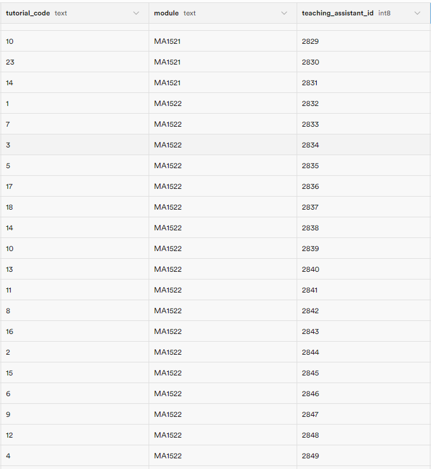

# 1. Deployed website

## https://nustuts.netlify.app

# 2. Proof-of-Concept

### Refer to the video demonstration on how to use our application:

https://drive.google.com/file/d/17Dv5VVigTR6NFeV3TsufSbN4Y2Rp96uE/view?usp=drive_link

# 3. README

### Refer to this README for a breakdown of the DB Schema, Design Architecture and flow, SWE Principles and Multi-Level Testing:

https://docs.google.com/document/d/1wJE-OL51aEQovnlj3ge90baGOeqsZfsa/edit?usp=drive_link&ouid=114700413390698458028&rtpof=true&sd=true

# 4. Project Log

### Refer to the attached spreadsheet for a breakdown of how many hours we spent on this project:

https://docs.google.com/spreadsheets/d/1NA-8EaBFYRfzXTh352eEwP2trf-CBc02v0mFFmVL8lo/edit?usp=sharing

# 5. Test accounts

### Some Student Accounts

Email: zack@gmail.com  
Password: zack

Email: hello@gmail.com  
Password: hello1

Email: rag@gmail.com  
Password: rag

Email: cy@gmail.com  
Password: cy

### Some TA Accounts

We have over 4000+ TAs whose accounts are auto-generated by a backend helper function and there is no signup for TA. Thus, we are unable to post every single TA account here. We have posted some screenshots of TA accounts for popular modules like MA1521, MA1522, CS1101S, CS1231, CS1231S, CS2040, CS2040S, CS2100, CS2102. The password for each TA account, is the username of TA according to their email. For example, if the TA email is ta135600@gmail.com, then the password to this TA account is ta135600.
Below are images of the tutorials and their respective TAs. The tutorial code is the tutorial class number for that tutorial.

|    Module Name & TA id    | TA id & Account details |
| :-----------------------: | :---------------------: |
|  |    |
|  |    |
|  |    |
|  |    |
|  |    |
|  |    |
|  |    |
